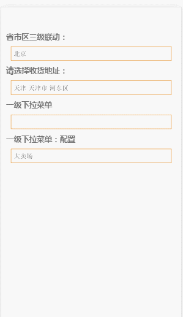

>简介

# link-menu
这是一个关于下拉选择城市的demo。
有移动端和web端两种。

>技术栈

移动端：zepto.js

web端：jQuery.js

开发和调试工具：sublime   Chrome

打包压缩：grunt

>项目运行
#  npm install http-server -g
安装一个全局的sever

#  http-server -p 8080
启一个8080的端口
然后就可以查看这个demo了。

>项目预览图 

移动端:  
 

web端：  
  

